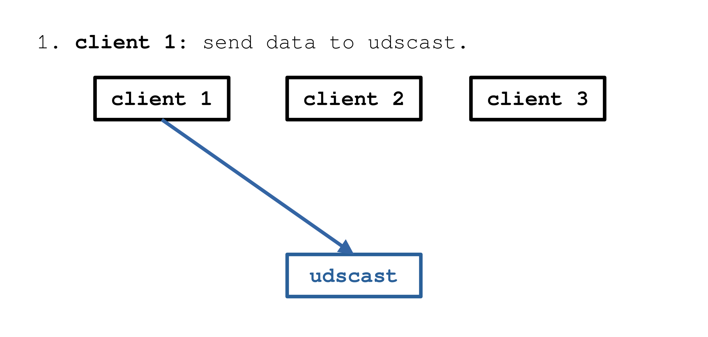

# 

*udscast, UDScast*

Unix Domain Socket Broadcast

# How It Works

UDScast creates a Unix domain socket on launch. Clients may connect to this socket and send data to it.

UDScast sends this recieved data to all clients connected to the same socket.

